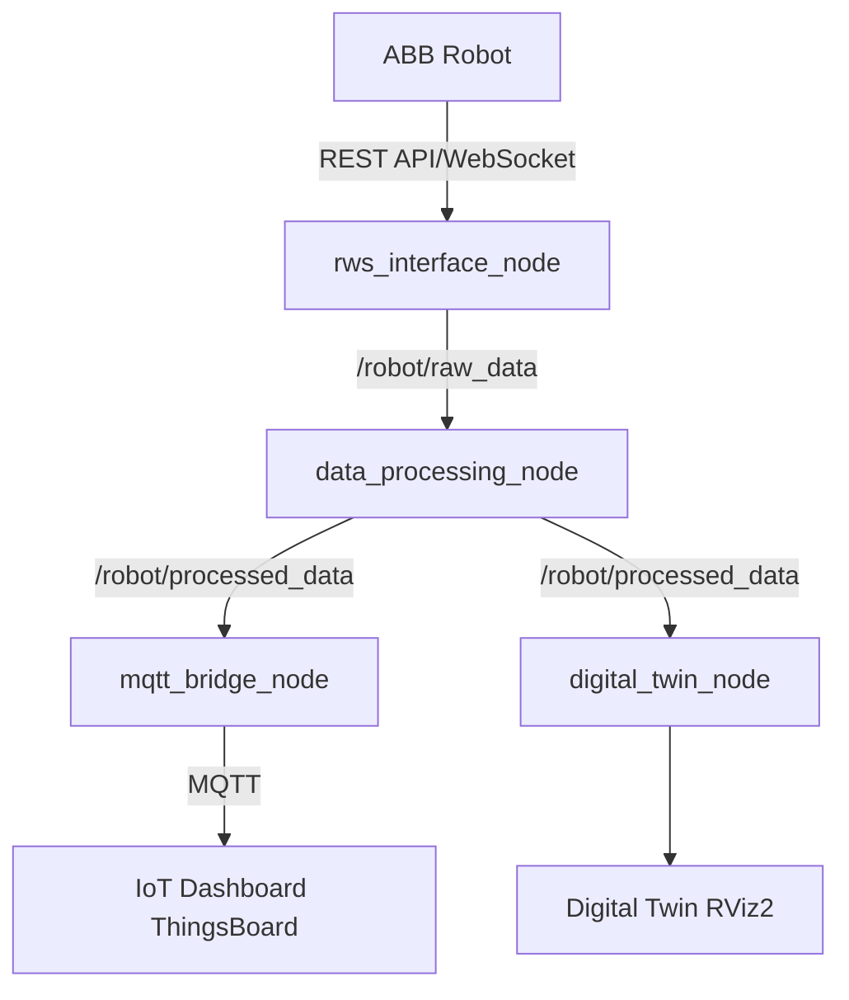
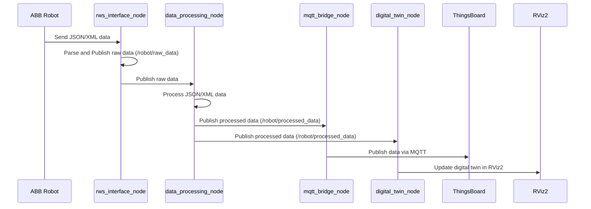
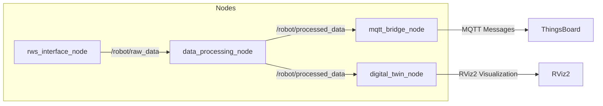

# ABB RWS - ROS INTEGRATION

## System Architecture Diagram

```mermaid
graph TD
    ABB_Robot[ABB Robot]
    rws_node[rws_interface_node]
    processing_node[data_processing_node]
    mqtt_node[mqtt_bridge_node]
    twin_node[digital_twin_node]
    ThingsBoard[IoT Dashboard ThingsBoard]
    RViz2[Digital Twin RViz2]
    
    ABB_Robot -- REST API/WebSocket --> rws_node
    rws_node -- "/robot/raw_data" --> processing_node
    processing_node -- "/robot/processed_data" --> mqtt_node
    processing_node -- "/robot/processed_data" --> twin_node
    mqtt_node -- MQTT --> ThingsBoard
    twin_node --> RViz2

```

## Data Flow Diagram

```mermaid
sequenceDiagram
    participant Robot as ABB Robot
    participant RWS as rws_interface_node
    participant Processing as data_processing_node
    participant MQTT as mqtt_bridge_node
    participant Twin as digital_twin_node
    participant IoT as ThingsBoard
    participant Visualization as RViz2

    Robot->>RWS: Send JSON/XML data
    RWS->>RWS: Parse and Publish raw data (/robot/raw_data)
    RWS->>Processing: Publish raw data
    Processing->>Processing: Process JSON/XML data
    Processing->>MQTT: Publish processed data (/robot/processed_data)
    Processing->>Twin: Publish processed data (/robot/processed_data)
    MQTT->>IoT: Publish data via MQTT
    Twin->>Visualization: Update digital twin in RViz2

```

## Node Interaction Diagram

```mermaid
flowchart LR
    subgraph Nodes
        RWS[rws_interface_node]
        Processing[data_processing_node]
        MQTT[mqtt_bridge_node]
        Twin[digital_twin_node]
    end

    RWS -- "/robot/raw_data" --> Processing
    Processing -- "/robot/processed_data" --> MQTT
    Processing -- "/robot/processed_data" --> Twin
    MQTT -- "MQTT Messages" --> ThingsBoard
    Twin -- "RViz2 Visualization" --> RViz2

```